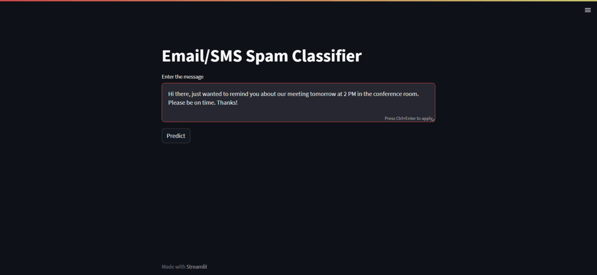

# Email/SMS Spam Classifier

The **Email/SMS Spam Classifier** is a machine learning-based application that predicts whether a given text message is spam or not. It employs Natural Language Processing (NLP) techniques to preprocess the text and a trained machine learning model for prediction.


## Project Demo 🎥



## Table of Contents
- [Introduction](#introduction)
- [Problem Statement](#problem-statement)
- [Tools and Technologies Used](#tools-and-technologies-used)
- [Approach](#approach)
- [Instructions to Run](#instructions-to-run)
- [Sample Usage](#sample-usage)
- [Contributing](#contributing)


## Introduction

The **Email/SMS Spam Classifier** is designed to help users identify whether an input text message is likely to be spam or not. It leverages a pre-trained machine learning model and text preprocessing techniques to provide quick and accurate predictions.


## Problem Statement

In today's digital communication landscape, spam messages have become increasingly prevalent. The **Email/SMS Spam Classifier** addresses this issue by offering a tool that can automatically classify incoming messages as spam or not spam, enabling users to focus on legitimate and relevant content.


## Tools and Technologies Used ⚙️

The **Email/SMS Spam Classifier** is built using the following tools and technologies:

- Python
- Streamlit
- NLTK (Natural Language Toolkit)
- Scikit-learn


## Approach

The application follows a structured approach for classifying email/SMS messages:

1. **Preprocessing:** The input text is preprocessed by converting it to lowercase, tokenizing, removing stopwords and punctuation, and stemming the words.

2. **Vectorization:** The preprocessed text is transformed into a numerical format using a pre-trained TF-IDF (Term Frequency-Inverse Document Frequency) vectorizer.

3. **Prediction:** The TF-IDF vectorized input is fed into a trained machine learning model to make a prediction.

4. **Display:** The prediction result is displayed to the user, indicating whether the input message is classified as spam or not spam.


## Instructions to Run 🏃‍♂️

1. Clone the repository:

```bash
git clone https://github.com/your-username/email-sms-spam-classifier.git
cd email-sms-spam-classifier
```

2. Install dependencies:

```bash
pip install streamlit nltk scikit-learn
```

3. Download NLTK data by running Python in your terminal:

```bash
python -c "import nltk; nltk.download('stopwords'); nltk.download('punkt')"
```

4. Place the pre-trained model and vectorizer pickle files (model.pkl and vectorizer.pkl) in the project directory.

5. Run the Streamlit app:

```bash
streamlit run app.py
```


## Sample Usage

1. Enter a text message in the provided text area.

2. Click the "Predict" button to see the prediction result.

3. The app will display whether the input message is predicted to be spam or not spam.


## Contributing 🛂

Contributions are welcome! If you find any issues or have ideas for improvements, feel free to submit a pull request.


